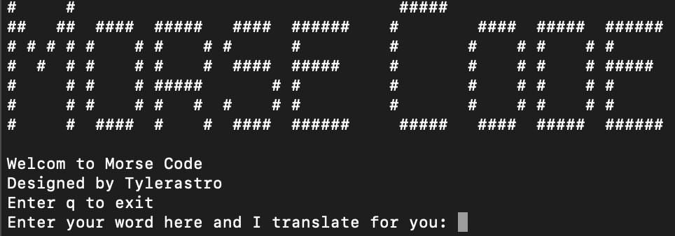

# MorseCode

This program translates English to morse and vice versa.
Type in your terminal to install:

`pip install Morse-Translator`

## Usage

In your terminal:
`morse`

And voila, the terminal would open the morse code translator.

## Note
The dictionary is not complete yet. Special characters are not included.
This is in the pre-Alpha stage.